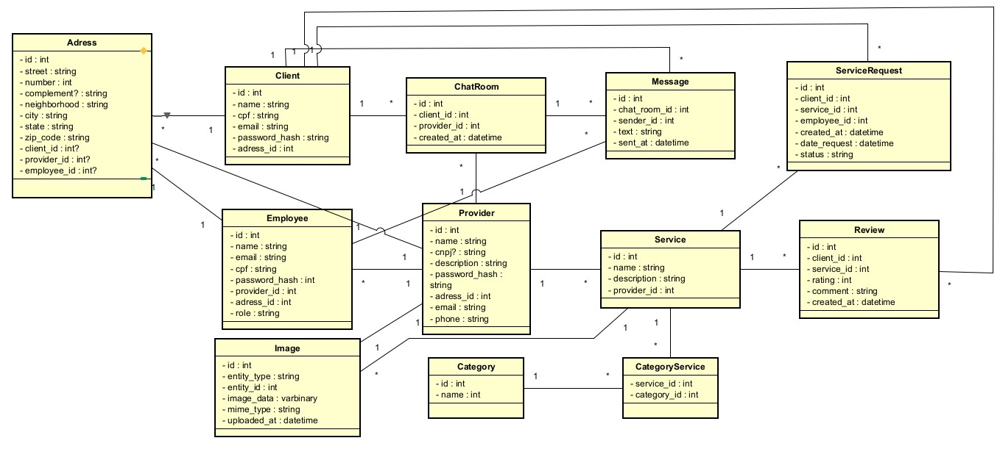

# Services-API

O services tem a missão de ser um sistema de gerenciamento serviços e funcionários por parte da pessoa jurídica e também ser uma central para pessoas físicas de visualização de serviços disponibilizados por esses empresas.

## Diagrama de classes
